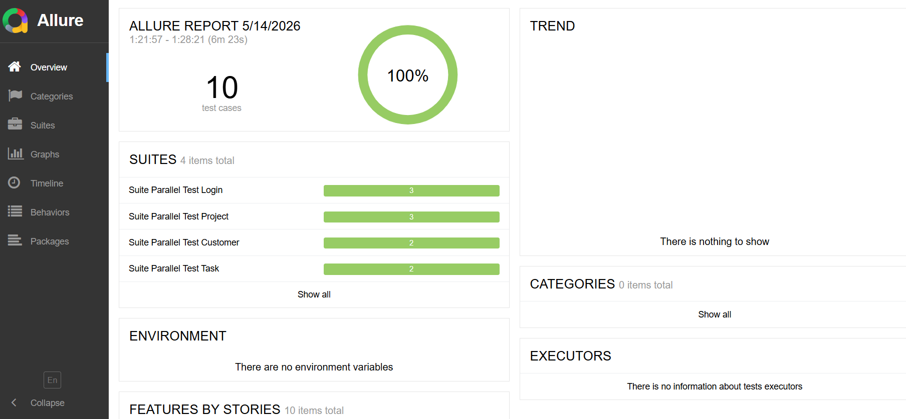

# Final Project
Selenium Java 2026

# 🚀CRM Automation Testing Framework
A highly scalable UI automation testing framework built with Java, TestNG, and Selenium WebDriver. This project implements the Page Object Model (POM) design pattern, features a Data-Driven architecture, and integrates Allure Reporting for detailed execution insights.

# 🎯Purpose
This project simulates a real-world CRM testing environment, focusing on:
- Scalable Test Design: Easy to expand as the application grows.
- Clean Architecture: Clear separation of concerns for better maintainability.
- Data-Driven Strategies: Testing multiple scenarios using external data sources.
- High Reusability: Modular components to reduce code duplication.

# 🧩Test Coverage
The framework covers critical CRM functionalities with various test scenarios:
- **Authentication:** testLoginSuccess, testLoginFailWithEmailInvalid, testLoginFailWithPassInvalid, testLoginSuccessFromDataProvider
- **Customer Management:** testAddNewCustomer, testAddCustomer_WithNullCompany
- **Project Management:** testAddNewProject, testEditProject, testDeleteProject
- **Task Management:** testAddNewTask_FromProjectPage, testAddNewTask_FromTaskPage

# 🛠 Technologies
- Java (JDK 17+)
- Maven
- TestNG
- Selenium WebDriver
- Apache POI
- Allure Report
- Log4j2

# ⚙️ Setup & Installation
Requirements
- JDK 17
- Maven 4.0.0
- ChromeDriver / EdgeDriver (or WebDriverManager)

```
git clone https://github.com/nquynhhhhhhh/final-project.git
cd Project_Cuoi_Khoa.git
```

# ▶️Run tests and Report
1. Run all tests:
```
mvn clean test
```
2. Generate report:
```
allure generate target/allure-results -o target/allure-report
```
3. Test Results (Allure Report):

Overview

Shows test execution summary with pass rate and suite distribution.



# 👩‍💻 Author
**Phạm Như Quỳnh**
